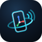
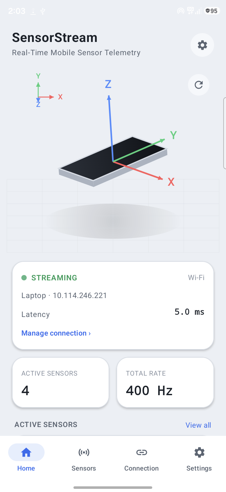
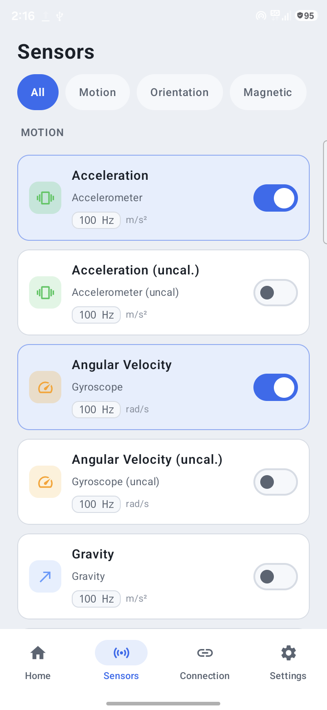
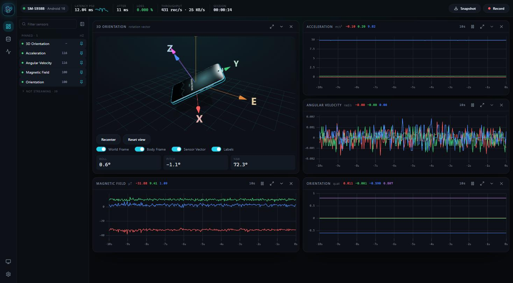
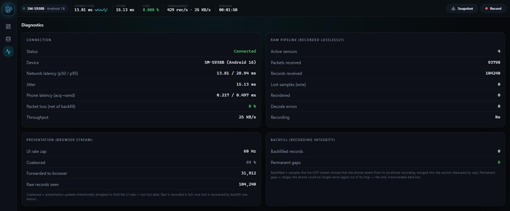
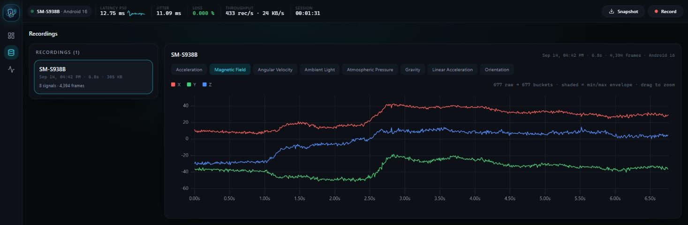
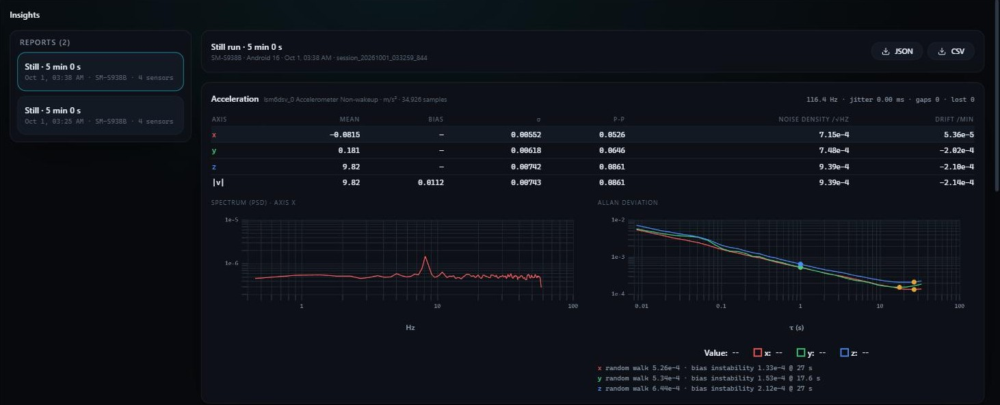
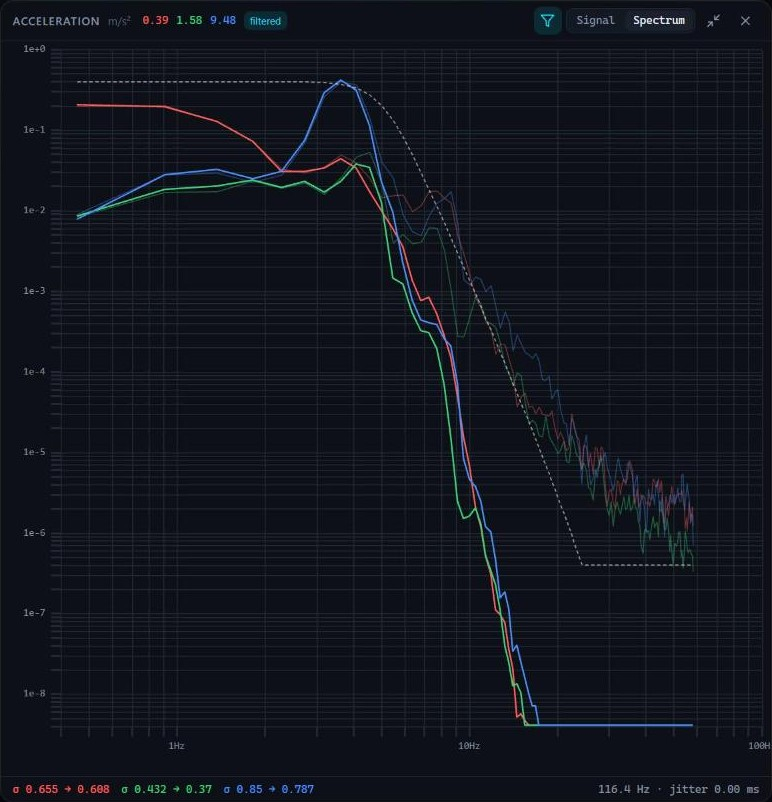

<p align="center"></p>

# SensorStream — Real-Time Mobile Sensor Telemetry & Visualization

Turn an Android phone into a low-latency, multi-sensor telemetry device and stream its
sensors to a laptop — with live values, real-time graphs, and a 3D view of the phone's
orientation. Built as a proper telemetry system: correctness → low latency → high-rate
stability → synchronization → smooth visualization, with lossless recording and an
optional ROS 2 bridge.

> **No phone? No Android build tools? You can still try everything** — see
> [Try it without a phone](#try-it-without-a-phone-30-seconds). A prebuilt APK is also
> published under [Releases](../../releases) so you can test on a real device without
> building the app.


## What's in the box

- **`android/`** — the phone app (Kotlin, Jetpack Compose). Enumerates sensors, streams
  them over UDP, control over WebSocket, with on-phone recording for screen-off integrity.
- **`laptop/`** — the receiver + browser dashboard (Python `asyncio` backend; React +
  Three.js + uPlot front-end in `laptop/webapp/`). Pluggable outputs via an `OutputSink`
  seam (`laptop/sensorstream/sinks.py`) — dashboard, lossless logger, and an optional
  **ROS 2** sink.
- **`laptop/tools/`** — `fake_phone.py` (a synthetic phone, no hardware needed) and
  `soak.py` (long-run stability test).
- **`docs/`** — protocol/schema, build & run, coordinate systems, the test plan, and
  troubleshooting.

## Features

| Area | What you get |
|---|---|
| Wire protocol | Compact little-endian binary over UDP; golden-vector-pinned codec (Python + Kotlin) |
| Receiver pipeline | Multi-sensor, per-sensor rate/loss metrics, latency without a clock handshake (min-filter), decode-error accounting |
| Reliability | On-phone bounded recording + laptop **backfill** (gap detect → resend → dedup) for lossless capture across Wi-Fi drops / screen-off |
| Dashboard | Mission-control layout: always-on link KPIs (latency, jitter, loss, throughput), a sensor picker with live Hz + health dots, and **pinnable panels** you can collapse or maximise — several live graphs at once (uPlot), 3D orientation (Three.js) with recenter/reset, **Snapshot → CSV** of the last 10–60 s, paged recordings browser with server-side LOD, light/dark themes |
| Phone app | Categorized sensors, per-sensor detail + sampling-rate config with **live actual Hz**, on-device pseudo-3D orientation with **recenter**, diagnostics, background streaming with a **Stop** action in the notification, **one-tap reconnect** to the last laptop, optional **packet batching**, and **export/share** of the on-phone recording |
| Filtering | Spectrum-guided per-axis filters (low-pass + notches), by hand on the dashboard or automatic with `--filter`: the phone guides a 10 s capture (prompt + buzzes) and the server tunes accelerometer, gyroscope and magnetometer from it; the filtered signal reaches the dashboard, ROS 2, recordings and the phone |
| Discovery | mDNS + UDP beacon: the phone lists every server on the network with its name, type and link quality |
| ROS 2 | Optional `--ros` sink: combined `sensor_msgs/Imu` (`/phone/imu/data_raw`, `/phone/imu/data`) stamped with the phone's measurement time, covariance from a Still test run, plus `MagneticField`, `QuaternionStamped` |

## Try it without a phone (30 seconds)

The receiver ships with a synthetic mode and a synthetic phone, so you can exercise the
entire pipeline — receiver, sync, dashboard, recording, ROS — with zero hardware.

```bash
cd laptop
python -m venv .venv
source .venv/bin/activate          # Windows: .venv\Scripts\activate
pip install -r requirements.txt

# Build the dashboard once (or skip it — a no-build fallback dashboard is served if you don't).
cd webapp && npm install && npm run build && cd ..

# Option A — built-in synthetic stream:
python -m sensorstream.app --selftest
#   → open http://localhost:8080

# Option B — a synthetic "phone" that connects like the real app (shows a live, tumbling 3D):
python -m sensorstream.app          # terminal 1
python tools/fake_phone.py          # terminal 2  → open http://localhost:8080
```

`fake_phone.py` speaks the real control + telemetry protocol: it appears on the dashboard
as a connected device with named sensors, and streams physically-consistent
accelerometer / gyroscope / magnetometer / orientation data (the accelerometer is gravity
in the device frame, so `|a| ≈ 9.81` and the 3D view tumbles smoothly). Flags: `--host`,
`--ws-port`, `--hz`, `--duration`.

## Prerequisites

- **Python 3.11+** — laptop backend.
- **Node.js 18+ / npm** — to build the React dashboard (optional; a legacy static dashboard
  is served as a fallback if `laptop/webapp/dist/` isn't built).
- **Android Studio** — only if you want to **build** the phone app. To just test on a real
  phone, install the prebuilt APK from [Releases](../../releases) instead.

## Run — laptop dashboard

```bash
cd laptop
python -m venv .venv
source .venv/bin/activate           # Windows: .venv\Scripts\activate
pip install -r requirements.txt

cd webapp && npm install && npm run build && cd ..    # build the dashboard once

python -m sensorstream.app          # add --selftest to demo without a phone
#   → http://localhost:8080
```

### Dashboard UI development (hot reload)

```bash
cd laptop/webapp
npm run dev        # Vite dev server; keep the Python server running alongside for live data
npm test           # unit tests (Vitest): history buffer, layout store, pin resolution, CSV
```

### Server flags

| Flag | Default | Purpose |
|---|---|---|
| `--selftest` | off | Emit a synthetic 4-sensor stream (no phone needed) |
| `--selftest-hz` | `100` | Synthetic sample rate |
| `--ros` | off | Publish decoded sensors to ROS 2 topics (requires a sourced ROS 2 environment) |
| `--ros-stamp` | `sensor` | ROS stamps: `sensor` = phone measurement time mapped to ROS time; `receive` = laptop arrival time |
| `--filter` | off | Automatic per-axis filters for accelerometer / gyroscope / magnetometer, tuned from a guided 10 s capture on the phone (app v0.1.13+) — see [Filtering](#filtering--let-the-spectrum-choose-the-filter) |
| `--filter-keep` | `0.99` | `--filter`: share of the motion's power each low-pass keeps (0.5–0.999). Lower = lower cutoffs, more noise removed, fastest motion smoothed (e.g. `0.95` for a slow robot) |
| `--filters-file` | `./filters.json` | Where the running filters are saved |
| `--filter-report` | next to `--filters-file` | Where `--filter` writes `filter_report.json` |
| `--record` | off | Record the session from start (to `--log-dir`, default `./recordings`) |
| `--http-port` | `8080` | Dashboard HTTP port |
| `--ws-port` | `8081` | Control WebSocket port |
| `--udp-port` | `5005` | Telemetry UDP port |
| `--ui-hz` | `60` | Max per-sensor update rate pushed to the browser (raw logging stays full-rate) |
| `--name` | computer name | Name shown in the phone's **Servers** list |
| `--no-discovery` | off | Disable mDNS + UDP beacon advertising |

## Run — Android app

**Easiest:** download the APK from [Releases](../../releases) on the phone and open it.
Android will ask you to allow installs from your browser or file manager (on Android 8+ this
is per-app: *Settings → Apps → Special access → Install unknown apps*). Or install from a
computer with `adb install -r app.apk`. No Android Studio needed; installing a newer APK over
an older one keeps your settings.

**From source:**

1. Open the `android/` folder in Android Studio and let Gradle sync (uses JBR 21).
2. Run on a physical device with USB debugging enabled — see [`docs/run.md`](docs/run.md)
   for the ADB build/install commands.
3. In the app: open **Connection**, tap your server in the **Servers** list (or enter its
   LAN IP + control port `8081` under *Enter address manually*), pick sensors on the
   **Sensors** tab, and **Connect & Stream**.

The phone and laptop must be on the **same Wi-Fi/LAN**. The app remembers the last laptop,
so next time **Start Streaming** on Home reconnects in one tap. Streaming continues in the
background via a foreground service; tap its notification to return to the app, or use its
**Stop** button to end the stream without opening it.

## Using the app

Once the laptop server is running and the phone is streaming, here's what you're looking at.

### On the phone

<p>
  
  
</p>

- **Home** shows a live 3D view of the phone's orientation (device axes vs. the world frame), plus connection status, latency (median of the last 10 heartbeat round trips, so one Wi-Fi hiccup doesn't jump the number), and the total sample rate (sensors set to **Max** count at their measured rate while streaming). Tap the **recenter** button (target icon) on the 3D view to zero it on the current pose; tap it again to return to absolute orientation. If the Wi-Fi link drops, the status shows **Reconnecting** and the app reconnects on its own (the phone keeps recording meanwhile, so the gap is backfilled).
- **Filtered Signals** (Home, when a filter is set on the laptop): per filtered sensor a live 10 s graph (raw faint, filtered bold; tap to switch axis), the filter (e.g. `LP 5 Hz · 4th + notch 8 Hz`) and **σ raw → filtered**; with `--filter`, its header has **Re-tune**. The phone runs the same filters itself and remembers the settings, so this keeps working offline. The sensor's detail graph also overlays the filtered trace. Hide it under **Settings → Filtering**.
- **Filter tuning** (server started with `--filter`): a card at the top asks you to pick up and move the phone, counts down, buzzes once to start and twice when done, then shows what was tuned per sensor, with **Re-tune** and **Dismiss**. See [Filtering](#filtering--let-the-spectrum-choose-the-filter).
- **Sensors** lists every sensor grouped by category (Motion / Orientation / Magnetic / …) with a per-sensor toggle and sampling-rate control — pick what you want to stream.
- **Connection** lists every SensorStream server on the network (scrollable): its name, type (laptop / desktop / Raspberry Pi), OS and address, with signal bars and the round trip measured from the phone. Tap one to choose where the phone streams; the last one used is marked and kept on top. A server that stops answering greys out and then drops off. *Enter address manually* covers networks that block discovery. The choice is remembered, and Home offers one-tap reconnect. Run several servers? Give each a `--name`.
- While streaming, sensor cards show the requested rate **and** the rate the sensor actually delivers (e.g. `100 Hz · 116 live`) — Android treats the requested rate as a hint.
- **Settings** adds:
  - **Packet batching** — *Low latency* (default, no added delay), *Balanced* (+~2 ms) or *Battery* (+~5 ms). Measured at 4 sensors × 100 Hz (≈430 samples/s): ~335, ~222 and ~132 packets/s respectively. Same data either way; only how samples are grouped into packets changes.
  - **Background streaming** status, with an *Allow* button if battery optimization could throttle screen-off streaming.
  - **Share recording** — exports the phone's rolling on-phone recording (up to 20 min) as a laptop-native `.ssbin` + `.meta.json` via the share sheet. Put both files in the laptop's `recordings/` folder to open them in the dashboard's **Recordings** view.

### On the laptop dashboard (`http://localhost:8080`)



The **Dashboard** is built for watching and comparing sensors:

- **KPI strip** (every page) — device, latency with a trend line, jitter, loss, throughput and session time, plus **Snapshot** and **Record**.
- **Sensor picker** (left) — every sensor the phone offers, with live Hz and a health dot (amber when a sensor's rate drops or it goes quiet). **Pin** a sensor to give it a panel; the ones not streaming are folded away.
- **Panels** — the 3D orientation (drag to orbit, double-click to reset, **Recenter** to zero the current pose) and one live graph per pinned sensor. Each panel can be collapsed, **maximised** (Esc to restore; adds per-axis and |v| toggles), paused, and switched between 5/10/30/60 s windows. Your layout is remembered — and carries over when you switch phones.
- **Snapshot** — downloads the last 10/30/60 s of the pinned (or all) sensors as a CSV. This is the display-rate stream; use **Record** for the full-rate, lossless capture.

Two more views are worth knowing:

- **Diagnostics** — end-to-end latency (p50/p95), jitter, on-phone latency, packet loss *net of backfill*, and recording-integrity counters.

  

- **Recordings** — browse recorded sessions and inspect their signals (server-side level-of-detail history). The list loads 50 at a time, newest first, with **Load more**.

  

### Insights — noise, drift, spectra and test runs

Everything here is computed **on the laptop server from the full-rate stream** (the browser only
ever receives a decimated display copy, which would give wrong noise figures and an aliased spectrum).

- **On every graph panel** — a footer with σ per axis (last 10 s), the true sample rate and interval
  jitter, and a **Signal / Spectrum** switch that shows the sensor's power spectral density.
- **Test run** (top bar) — pick a preset and a duration, keep still, and get a report:
  - **Still** — lay the phone (and your robot) flat and motionless. Reports bias against gravity
    (accelerometer magnitude vs 9.80665 m/s²) and zero rate (gyroscope), σ, peak-to-peak, **noise
    density** (units/√Hz), drift per minute, rate/jitter/gaps/lost samples, and for runs of 2 min or
    longer the **Allan deviation** with random walk (σ at τ = 1 s) and bias instability — the numbers
    IMU datasheets quote, so you can hold your own sensors to the same yardstick.
  - **Capture** — the same statistics without reference values (e.g. while moving).
- **Insights page** — every report with its tables, spectrum and Allan plot, exportable as JSON or CSV.
  A run is an ordinary lossless recording, so **Recordings → Analyse** can produce a report for any
  earlier recording too.



### Filtering — let the spectrum choose the filter

SensorStream can filter the accelerometer, gyroscope and magnetometer for you, one filter per axis,
chosen from what the spectrum shows: a low-pass where the real signal ends and the noise begins,
plus notches for narrow vibration lines (a motor, a fan). Let the server do it automatically
(guided by the phone), or tune by hand on the dashboard. The raw data is always kept.

#### Quick start — automatic, guided filters

You need the phone app **v0.1.13 or newer** (APK from [Releases](../../releases)) for the guided
prompt; older apps still get automatic filters, just without the prompt (see below).

```bash
cd laptop
python -m sensorstream.app --filter      # add --ros to publish the filtered topics to ROS 2 too
```

1. On the phone, under **Sensors**, switch on **Acceleration**, **Angular Velocity** and (if you want
   it) **Magnetic Field**. Then **Connection** → pick your server → **Connect & Stream**.
2. About 2 s later the phone shows **"Pick up the phone and move it the way you'll use it"** and
   counts down 3 s. (If you haven't done a **Still test run** for this phone yet, it first asks you to
   **leave the phone on the table for 3 s** — that measures the sensor noise — and then to pick it up.)
3. **One buzz** → move the phone the way it will be used (in your hand, on the robot's mount, tilting
   and turning as in real use) while the screen counts down **10 s**.
4. **Two buzzes** → done, put it down. The phone shows what it tuned per sensor, e.g.
   `✓ Accelerometer: X/Y LP 6.2 Hz | Z LP 9.4 Hz · noise 4.8x lower`, and the laptop prints a table
  per sensor.
5. That's it — the filtered signal now goes everywhere (dashboard, ROS 2 `*_filtered`, recordings,
   the phone). To repeat it (new mount, different use), tap **Re-tune** on the phone: on the result
   card or on the **Filtered Signals** card on Home. To look closer or adjust, use a panel's
   **Filter** button on the dashboard (see *Tuning by hand*).

> **Why move the phone?** The filter is tuned to the motion it sees during those 10 s. A phone lying
> still shows only noise, which gives very low cutoffs (e.g. 0.5 Hz, about 0.8 s of lag) — right for
> a phone that really stays still, wrong for one that moves.

No phone at hand? `python -m sensorstream.app --selftest --filter` tunes the synthetic stream after
10 s (no prompt — the selftest has no phone).

#### What `--filter` does, in detail

- **Which sensors:** accelerometer, gyroscope and magnetometer (those that are streaming); each axis
  gets its own low-pass (4th-order Butterworth) and up to 3 notches. Orientation and on-change sensors
  are never filtered.
- **When:** once per phone connection — about 2 s after the phone connects, one guided capture for
  all streaming sensors. A sensor switched on later gets its own prompt, opened by a stronger
  **triple buzz** (alarm-type vibration, so it also buzzes with the ringer on silent; Do Not Disturb
  may still block it). With the app in the background, the streaming notification shows the
  instruction and countdown. A reconnect (even after a Wi-Fi blip) tunes again from fresh data.
- **Noise is measured, not guessed:** the cutoff goes where your motion sinks into the sensor's real
  noise, keeping 99 % of the motion's power (`--filter-keep 0.95` keeps 95 %: lower cutoffs and more
  noise removed, at the cost of the fastest movements). The noise comes from a **Still test run** for your phone
  model if you have one (Test run → Still, once); otherwise from 3 s of the phone lying still at the
  start of the capture. The report shows the noise before → after (e.g. `noise 4.8x lower`). A
  capture where the phone didn't move is refused ("Re-tune and move it") rather than giving a filter
  that would smear real motion.
- **Only the capture counts:** the phone marks the 10 s window with the sensors' own timestamps,
  starting 0.5 s after the buzz, so the vibration never enters the analysed data.
- **Axes that didn't move** (e.g. a robot driving straight never rotates about X) get the lightest filter
  of the axes that did — never a 0.5 Hz filter with ~0.8 s of lag. A sensor where nothing moved at all
  is left unfiltered until there is motion to tune from.
- **It replaces saved filters** for those sensors (in `filters.json`). To keep hand-tuned filters,
  run without `--filter` — saved filters keep running either way.
- **Fallbacks:** with an older phone app, or when a capture never arrives, is cancelled or fails (see
  *Troubleshooting filters*), the sensor is tuned automatically from its last 10 s, 60 s after it
  started streaming; the console says so. Without any phone (`--selftest`), after 10 s.
- **What it reports:** per sensor and axis — the noise floor (noise density), the chosen low-pass and
  the delay it adds, each notch and how far its peak stood out, and the expected σ before → after.
  Printed on the laptop, written to `filter_report.json`, and shown in the dashboard's filter pane
  under *Spectrum findings*.

The laptop console after a guided capture looks like this:

```
[filter] guided tuning (connect): prompted lsm6dsv_0 Accelerometer Non-wakeup, lsm6dsv_0 Gyroscope Non-wakeup
[filter] guided tuning: capture received (2 of 2 sensors)
[filter] Acceleration (lsm6dsv_0 Accelerometer Non-wakeup) @ 116.4 Hz
   axis  noise/rtHz   cutoff   order  delay    notches              noise sd raw -> filtered
   X     7.73e-04     6.20     4        67 ms  -                    0.008322 -> 0.002712
   ...
   (noise 3.1x lower; noise measured from the still)
```

#### Tuning by hand (dashboard)

Each graph panel has a **Filter** button (funnel). It opens the filter editor as a **pane on the
right** (the panels narrow to make room; the edited panel is outlined). **Suggest from spectrum**
proposes a filter from the live spectrum; tweak the cutoff (slider), order (2/4) and notches, then
**Apply**. The pane stays open so you can compare and adjust; ✕ or Esc closes it.

- Filtering runs on the laptop server on **every full-rate sample**, before the display stream is
  down-sampled, using causal real-time filters (the kind a robot stack runs), so what you see is
  exactly what a downstream consumer would get.
- The panel then shows raw (faint) and filtered (bold) traces, the footer shows **σ raw → filtered**,
  and the **Spectrum** view shows the raw spectrum, the filtered "after" spectrum and the filter's
  response (dashed).
- **Per axis**: tick *Per axis* to give X, Y and Z their own filter (e.g. a lower cutoff on X/Y and a
  notch only on Z). *Suggest from spectrum* then fills each axis from its own spectrum, and the
  Spectrum view draws one response curve per axis.
- *Spectrum findings* in the pane show what the spectrum showed per axis (as in the `--filter`
  report), after `--filter` or a *Suggest*.
- If the running filter changes while you edit (e.g. `--filter` re-tuned it), the pane says so and
  offers **Reload**; **Apply** would replace it with your settings.
- Settings are per sensor, shared by every open dashboard, and saved in `filters.json`.



#### Files

| File | Written by | What's in it |
|---|---|---|
| `filters.json` (`--filters-file`) | Apply / Clear on the dashboard, `--filter` | The filters that run, per sensor (kept across restarts, pushed to the phone) |
| `filter_report.json` (`--filter-report`; default next to `filters.json`) | `--filter` | Per sensor and axis: sample rate, noise density, cutoff and order, delay, notches with prominence, expected σ raw / filtered, time; plus the phone model |

The `.ssbin` recording always stays raw (filtered values appear only as extra CSV columns), so you
can re-filter differently later.

**Where the filtered signal goes** (only for sensors with a filter; raw outputs never change):
- **ROS 2**: `/phone/accelerometer_filtered`, `/phone/gyroscope_filtered`, `/phone/magnetic_field_filtered`,
  `/phone/imu/data_raw_filtered`, `/phone/imu/data_filtered` (same message types as the raw topics, full rate).
- **Recording CSV**: extra columns `f0,f1,f2` next to `v0..v5` (empty when no filter; the `.ssbin`
  stays raw, and samples recovered by backfill are never filtered).
- **Snapshot CSV**: extra columns `fx,fy,fz`.
- **Phone**: the laptop sends its filter settings to the phone on connect and on every change; the
  phone saves them and filters its own samples (designed for the phone's measured rate), shown on
  Home and the sensor detail graph, even when disconnected. Streaming to the laptop stays raw.

#### Troubleshooting filters

| You see | What it means / what to do |
|---|---|
| No prompt and no buzz on the phone | The app is older than v0.1.13 (update it; meanwhile filters are still tuned automatically 60 s after each sensor starts), or the server was started without `--filter`. |
| A prompt but no buzz | Vibration is off or Do Not Disturb blocks it; follow the on-screen countdown instead. |
| `the phone didn't move during the capture` | Nothing stood out of the sensor noise. Tap **Re-tune** and move the phone as in real use. |
| Noise only slightly lower (e.g. `1.2x lower`) | Your motion uses most of the bandwidth (fast shaking/vibration), so the filter keeps it; that is correct. For a smoother signal, move more gently during the capture or lower the cutoff by hand. |
| `not enough data in the capture` / `data gap during the capture` | The stream was interrupted (Wi-Fi drop, sensor switched off/on) during the 10 s. Tap **Re-tune**; otherwise it is tuned automatically at 60 s. |
| `the rate estimates disagree` | The sampling rate was still settling (just after starting or changing a sensor's rate). Tap **Re-tune** a few seconds later. |
| `[filter] ... still waiting - <reason>` on the laptop | A sensor hasn't been tuned well past its time; the reason says why (e.g. gaps or irregular timestamps). |
| `[filter] guided tuning: no capture from the phone` | The phone never sent the capture (app closed, link dropped); those sensors are tuned automatically at 60 s. |
| Your hand-tuned filter was replaced | `--filter` re-tunes on every (re)connect. Run without `--filter` to keep saved filters. |
| The card stays on "Working out the filters…" | The laptop never answered (e.g. it restarted); tap **Dismiss**, then **Re-tune**. |

## ROS 2 bridge (optional)

With a ROS 2 environment sourced, `--ros` publishes decoded sensors as standard messages:

| Topic | Message | Source sensor |
|---|---|---|
| `/phone/accelerometer` | `sensor_msgs/Imu` | accelerometer |
| `/phone/gyroscope` | `sensor_msgs/Imu` | gyroscope |
| `/phone/magnetic_field` | `sensor_msgs/MagneticField` | magnetometer, in **tesla** as the message defines (Android reports microtesla; converted) |
| `/phone/orientation` | `geometry_msgs/QuaternionStamped` | rotation vector |
| `/phone/imu/data_raw` | `sensor_msgs/Imu` | gyroscope + accelerometer, no orientation (input for `imu_filter_madgwick`) |
| `/phone/imu/data` | `sensor_msgs/Imu` | the same + orientation from the rotation vector (for `robot_localization`) |
| `/phone/imu/data_raw_filtered`, `/phone/imu/data_filtered` | same as the raw topic | while the accelerometer or gyroscope has a filter (filtered value where there is one; orientation never filtered) |
| `/phone/accelerometer_filtered`, `/phone/gyroscope_filtered`, `/phone/magnetic_field_filtered` | same as the raw topic | the filtered signal, only while that sensor has a filter (see Filtering) |

```bash
# with ROS 2 sourced:
python -m sensorstream.app --ros        # or add --selftest / use fake_phone.py
ros2 topic echo /phone/accelerometer
```

Without ROS sourced, `--ros` prints a warning and the server runs normally.

- **Combined IMU**: one message per gyroscope sample, with the newest accelerometer sample (skipped when
  that is more than 3 samples old). `/phone/imu/data` is published only while the rotation vector streams.
- **Timestamps**: every message is stamped with when the phone measured the sample, mapped to ROS time
  from the fastest packets of the last 10 s - no Wi-Fi jitter, a constant ~1 ms late (the fastest
  transit). The mapping follows clock drift smoothly (at most 1 ms/s). Packets arriving more than 1 s
  late (a stalled link) are treated as network delay and never move it; it is corrected once only when
  packets prove it too late (arriving over 1 s early for 0.5 s). Only continuous sensors feed it, not
  on-change ones like the step counter. `--ros-stamp receive` restores laptop-arrival stamps.
- **Covariance**: run a **Still** test run once per phone model (Test run -> Still, 2 min, phone flat and
  untouched). Its per-axis sigma squared fills the accelerometer, gyroscope and magnetometer covariances
  on every topic, picked up immediately; the server prints which report it uses. Orientation: yaw from
  the rotation vector's own heading accuracy, roll/pitch estimated as (accelerometer sigma / 9.81)^2 (an
  approximation, usually on the high side); if the phone gives no heading accuracy, orientation
  covariance stays 0 (unknown) rather than claiming an exact yaw. Without a Still run the covariances are 0 (ROS "unknown").
  Filtered topics carry the raw covariance (conservative).
- **Frames**: `frame_id` is `phone`. Android's device axes (x right, y up the screen, z out of the screen)
  and its East-North-Up world frame match REP-103/REP-145, so no conversion is applied. "North" is
  **magnetic** north (the rotation vector uses the magnetometer): set your magnetic declination (e.g.
  `navsat_transform`'s `magnetic_declination_radians`) if you need true north. No TF is published for
  `phone`; add a static transform from your robot's base frame.

## Network priority on a busy Wi-Fi

On a shared network, bandwidth is arbitrated by the router/AP, not an app — an app can only
*hint*. SensorStream tags telemetry with **DSCP EF** and control with **DSCP AF41**, and
the receiver marks its socket to match; on APs that honor DSCP→WMM (most do) this gives the
stream preferential airtime under contention. It's best-effort — browsers can't be tagged,
so the dashboard's own traffic isn't prioritized. For a guaranteed result with many devices:
give phone + laptop their own link (phone hotspot, or a separate 5 GHz SSID), or set router
QoS on the laptop's IP / the ports (UDP 5005, WS 8081).

## Tests

```bash
# Python (from laptop/, venv active)
cd laptop && python -m pytest

# Android (from android/) — use Gradle, not the IDE JUnit runner
./gradlew test        # Windows: gradlew.bat test
```

**Soak test** — `python tools/soak.py --minutes 2` launches the server on isolated ports,
blasts a wire-identical multi-sensor load, samples memory/throughput/latency, and prints a
PASS/FAIL report (no phone needed). It fails on decode errors, permanent gaps, throughput
drift >10%, RSS growth like a leak, or a crash.

## Roadmap

- [x] Wire protocol + codecs, receiver pipeline, discovery, auto-reconnect
- [x] On-phone recording + laptop backfill (lossless across drops)
- [x] Dashboard (cards, graphs, 3D, recordings browser, light/dark)
- [x] Dashboard redesign: KPI strip, sensor picker, pinnable/maximisable panels, Snapshot CSV
- [x] Dashboard insights: per-axis stats, noise density, spectrum, drift, rate stability, Allan deviation, test runs
- [x] Spectrum-guided filtering on the dashboard (suggest, tweak, before/after)
- [x] Filtered signal on ROS 2 (`*_filtered` topics) and in CSV exports
- [x] Filtered signal on the phone (on-phone filter, settings synced from the laptop, Home screen)
- [x] Per-axis filters; filter side pane with spectrum findings
- [x] Automatic filters (`--filter`) with a guided capture on the phone (prompt, buzzes, Re-tune)
- [ ] Recording tools: naming/tags, playback scrubber, CSV export of recordings
- [x] Phone app redesign (Compose) with on-device 3D orientation
- [x] ROS 2 output sink (`--ros`)
- [ ] Verify screen-off streaming end-to-end against the redesigned dashboard UI
- [ ] Second-device / light-theme streaming pass on more hardware
- [x] Recordings pagination
- [x] Phone app: 3D recenter, reconnect status, packet batching, recording export
- [ ] Real-phone long-run soak (synthetic soak already passes)
- [ ] Phone-vs-phone comparison: still test (noise / bias vs. gravity & zero-rate) and same-motion overlay

## Contributing & reporting bugs

Contributions and bug reports are welcome. Please open an issue using the **Bug report**
template — include your OS, Python/Node versions, phone model + Android version (if used),
and steps to reproduce. If you can reproduce with `--selftest` or `tools/fake_phone.py`,
say so; that makes triage much faster. PRs should keep `python -m pytest` and
`./gradlew test` green.

## Reference

Wire format: [`docs/protocol.md`](docs/protocol.md) ·
Build: [`docs/build.md`](docs/build.md) ·
Run: [`docs/run.md`](docs/run.md) ·
Coordinate systems: [`docs/coordinate-systems.md`](docs/coordinate-systems.md) ·
Test plan: [`docs/test-plan.md`](docs/test-plan.md) ·
Dashboard performance (ADR-001): [`docs/adr-001-dashboard-performance.md`](docs/adr-001-dashboard-performance.md) ·
Troubleshooting: [`docs/troubleshooting.md`](docs/troubleshooting.md)

## License

[MIT](LICENSE) © 2026 Devam
